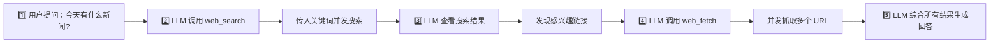

<div align="center">


# 🌐 Bing Web Search

> **调用 Edge 浏览器为 LLM 提供联网搜索和网页抓取能力**

---


  
  
  

</div>

---

## 📦 安装依赖

### 📦 安装 Python 依赖

```bash
pip install DrissionPage
```

---

## 📚 功能概览

>本插件基于 `DrissionPage` 浏览器自动化，调用 Edge 浏览器进行 Bing 搜索，为 LLM 提供联网搜索获取信息的能力。

| 工具 | 名称 | 功能 |
|:---:|:---|:---|
| 🔍 | `web_search` | Bing 联网搜索（并发） |
| 📄 | `web_fetch` | 网页内容抓取（并发） |

---

### 🔍 `web_search` — Bing 联网搜索

- **描述**: 并发搜索多个关键词，获取实时网络信息
- **参数**: `keywords`（字符串数组）
- **搜索语法**:
  - `-` 排除特定词
  - `""` 精确匹配
  - `*` 模糊搜索
  - `filetype:` 指定文件类型
  - `site:` 限定网站范围
  - `intitle:` / `allintitle:` 标题匹配
  - `inurl:` 网址匹配
  - 日期范围限定

---

### 📄 `web_fetch` — 网页内容抓取

- **描述**: 并发抓取多个 URL 的页面文本内容
- **参数**: `urls`（字符串数组）
- **用途**: 搜索到结果后，一次性抓取多个链接的详情内容

---

## 💼 llm工作流程



---

## ⚙️ 配置项

| 配置项 | 说明 | 默认值 |
|:---|:---|:---|
| `search_timeout` | 搜索超时时间设置 | `60` 秒 |

---

## 📁 项目结构

```
astrbot_plugin_web_tools_ar/
│
├── 📄 main.py          # 插件入口
├── 📋 metadata.yaml     # 插件元数据
├── 📋 requirements.txt  # Python 依赖
├── 📋 _conf_schema.json # 插件配置
├── 📖 README.md        # 本文件
│
├── 📂 tools/           # LLM 函数工具目录
│   ├── 📄 __init__.py
│   ├── 📄 bing_search.py   # web_search - Bing 搜索
│   └── 📄 web_fetch.py     # web_fetch - 网页抓取
│
└── 📂 skills/          # Skill 文件
    └── 📄 SKILL.md     # 工具使用指南
```

---

## ⚙️ 架构说明

| 组件 | 职责 |
|:---|:---|
| `main.py` | 插件注册 + FunctionTool 实例化 + 超时配置 |
| `tools/bing_search.py` | `BingSearchTool` 类，基于 DrissionPage 驱动 Edge 实现搜索 |
| `tools/web_fetch.py` | `WebFetchTool` 类，基于 DrissionPage 驱动 Edge 抓取网页 |

### 技术特点

- 🔄 **并发执行**: 多个关键词/URL 同时处理，大幅提升效率
- 🔒 **端口隔离**: 每个浏览器实例使用独立调试端口，避免并发冲突
- ⚡ **条件等待**: 使用 `ele_displayed()` 替代硬编码 `sleep`，渲染完成立即返回
- 🛡️ **导入保护**: `try/except ImportError` 包裹 AstrBot API，支持独立测试

---

## ⚠️ 注意事项

| 项目 | 说明 |
|:---|:---|
| 🌐 **浏览器要求** | 需要安装 Microsoft Edge（支持 Windows/macOS/Linux） |
| 🔌 **浏览器驱动** | DrissionPage 自动检测并管理 Edge 浏览器，无需手动下载驱动 |
| ⏱️ **超时配置** | 默认 60 秒，可通过 `_conf_schema.json` 自定义 |
| 📊 **资源占用** | 每次搜索/抓取会启动独立 Edge 实例，操作完成后自动关闭 |

<div align="center">

### 如果这个插件帮到你了,请给个 Star 支持一下！⭐️

</div>