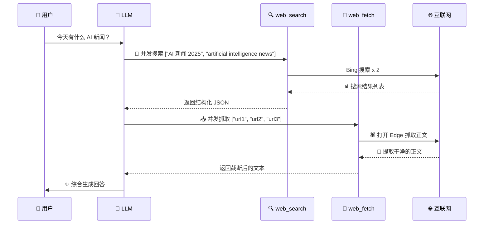

<div align="center">


# 🌐 AstrBot Web Tools

> **让 LLM 长出爪子和眼睛 —— 联网搜索 + 网页抓取，纯浏览器驱动，No API Key**

---

  
  
  
  
  
  <br>
  
  
  

</div>

---

## 🚀 Quick Start

```bash
# 1. 安装依赖
pip install DrissionPage trafilatura

# 2. 确保已安装 Microsoft Edge（Chrome 用户看下面👇）

# 3. 启动 AstrBot，向 LLM 提问：
#    "帮我搜索一下今天关于 AI 的新闻"
```

> 💡 **使用 Chrome 代替 Edge？** 修改 `bing_search.py` 和 `web_fetch.py` 中的 `_find_edge_path()` 指向 Chrome 路径即可。注意 Chrome 需要额外添加 `--remote-debugging-port` 参数。

---

## 📚 功能一览

| 工具 | 名称 | 一句话描述 |
|:---:|:---|:---|
| 🔍 `web_search` | Bing 联网搜索 | 并发搜索多个关键词，榨干 Bing 搜索结果 |
| 📄 `web_fetch` | 网页内容抓取 | 并发抓取多个页面，自动提取正文，带安全校验 |

---

## 💼 LLM 工作流程



---

## 🔍 `web_search` — Bing 联网搜索

并发搜索多个关键词，返回结构化 JSON 结果，支持 Bing 完整搜索语法。

**参数：**

| 参数 | 类型 | 说明 |
|:---|:---|:---|
| `keywords` | `array<string>` | 搜索关键词列表，可传多个实现并发搜索 |

**支持的搜索语法：**

| 语法 | 示例 | 效果 |
|:---|:---|:---|
| `-` 排除 | `AI -百度` | 排除包含"百度"的结果 |
| `""` 精确 | `"climate change"` | 精确匹配短语 |
| `site:` | `site:github.com astrobot` | 限定站点 |
| `filetype:` | `filetype:pdf AI report` | 指定文件类型 |
| `intitle:` | `intitle:机器学习` | 标题匹配 |
| `inurl:` | `inurl:blog` | URL 匹配 |

**返回示例：**

```json
{
  "query": "AI 新闻",
  "total_results": 8,
  "results": [
    {
      "rank": 1,
      "title": "2025 年 AI 最新进展",
      "url": "https://example.com/ai-news",
      "snippet": "人工智能在 2025 年取得了突破性进展...",
      "date": "2025-06-15",
      "source": "example.com"
    }
  ]
}
```

---

## 📄 `web_fetch` — 网页内容抓取

并发抓取多个 URL，自动提取正文、去噪、截断，带三层安全防护。

**参数：**

| 参数 | 类型 | 默认值 | 说明 |
|:---|:---|:---:|:---|
| `urls` | `array<string>` | — | 要抓取的 URL 列表 |
| `max_chars` | `int` | `10000` | 🔒 返回文本最大字符数，防止撑爆上下文 |
| `timeout` | `int` | `10` | 单次页面加载超时（秒） |
| `retries` | `int` | `3` | 失败重试次数 |

### 🛡️ 三层安全防护

```
1️⃣ 协议校验 ── 只允许 http:// / https://
                    ✋ file:// / ftp:// / data: 统统拒绝

2️⃣ IP 过滤 ── 禁止访问内网/私有地址
                    127.0.0.1 / 192.168.x.x / 10.x.x.x ➡️ 拦

3️⃣ 长度截断 ── 默认 10,000 字符兜底
                    几万字的长文自动截断，保 LLM 上下文不爆
```

---

## 📊 技术特性

| 特性 | 说明 |
|:---|:---|
| 🔄 **真正并发** | 每个 URL/关键词独立线程 + 独立浏览器实例，互不阻塞 |
| 🔒 **端口隔离** | 全局计数器分配端口，杜绝并发冲突 |
| ⚡ **条件等待** | `ele_displayed()` / `load_complete()` 替代 `sleep`，渲染完就返回 |
| 📦 **智能提取** | 集成 `trafilatura` 自动识别正文，去除导航/广告/页脚 |
| 🛡️ **导入保护** | `try/except ImportError` 包裹 AstrBot API，支持 `python xxx.py` 独立测试 |
| ♻️ **资源回收** | `try/finally` + `page.quit()` 保证 Edge 进程必关，不留僵尸进程 |

---

## ⚙️ 配置项

| 配置项 | 说明 | 默认值 |
|:---|:---|:---:|
| `search_timeout` | 搜索/抓取超时（秒） | `60` |

---

## 📁 项目结构

```
astrbot_plugin_web_tools_ar/
│
├── 📄 main.py              # 插件入口，注册 FunctionTool
├── 📋 metadata.yaml         # 插件元数据
├── 📋 requirements.txt      # Python 依赖清单
├── 📋 _conf_schema.json     # 可视化配置定义
├── 🖼️ logo.png              #  Logo
├── 📖 README.md             
│
├── 📂 tools/                # 🧰 LLM 函数工具
│   ├── 📄 __init__.py
│   ├── 📄 bing_search.py    # 🔍 web_search — Bing 搜索
│   └── 📄 web_fetch.py      # 📄 web_fetch — 网页抓取
│
├── 📂 skills/               # 📖 LLM 指令指南
    └── 📄 SKILL.md

```

---

## ⚠️ 注意事项

| 项目 | 说明 |
|:---|:---|
| 🌐 **浏览器** | 必须安装 Microsoft Edge（Windows/macOS/Linux 全平台支持） |
| 🔌 **驱动** | DrissionPage 自动管理，**不需要**手动下载 chromedriver |
| 📊 **资源** | 每个搜索/抓取启一个独立 Edge，上限 `4` 并发，用后自动关闭 |
| ⏱️ **超时** | 默认 60 秒，长页面可自行调高 |
| 🧪 **独立测试** | `python tools/bing_search.py -h` / `python tools/web_fetch.py` |
| 🏠 **安全** | `web_fetch` 内置 IP 黑名单，拒绝访问内网/回环地址 |

---

## 🧪 独立测试（无需 AstrBot）

```bash
# 测试 Bing 搜索
python tools/bing_search.py "AstrBot 插件"

# 并发搜索测试
python tools/bing_search.py --concurrent

# 测试网页抓取
python tools/web_fetch.py https://github.com

# 一次测试多个 URL
python tools/web_fetch.py https://www.baidu.com https://www.bing.com
```

---

## 🔄 Changelog

### v1.0.2 

- 🛡️ **新增 URL 安全校验**：限制协议、过滤内网地址
- 📏 **新增内容截断**：默认 10,000 字符，保护 LLM 上下文
- ⚡ **移除硬编码 sleep**：改用条件等待，速度更快
- 🎯 **代码优化**：引入 `@lru_cache` 缓存浏览器路径查找

### v1.0.1 

- **搜索模块**：实现真正并发（最多4实例），大幅缩短等待超时，新增滚动加载和空白页自动刷新；改为先访问首页再输入搜索，解决关键词不匹配问题。  
- **抓取模块**：集成 `trafilatura` 提升正文抽取，新增聚合页识别和噪音过滤。  
- **策略引导**：强化 LLM 构造精确关键词的能力，增加结果相关性自查和自动重试（最多3次）。  
- **通用机制**：两工具均加入指数退避重试，网络错误自动恢复并返回详细错误信息。

### v1.0.0

- 🎉 初始发布：Bing 搜索 + 网页抓取，支持真正并发

---

## 🏗️ 技术架构

```
┌─────────────┐     ┌─────────────────┐     ┌──────────────┐
│             │     │                 │     │              │
│  AstrBot    │────▶│  FunctionTool   │────▶│  Edge 实例    │
│  (触发)     │     │  (注册/分发)     │     │  (浏览器)     │
│             │     │                 │     │              │
└─────────────┘     └─────────────────┘     └──────┬───────┘
                                                    │
                                           ┌────────▼───────┐
                                           │                │
                                           │  DrissionPage  │
                                           │  (自动化引擎)    │
                                           │                │
                                           └────────────────┘
```

---

## 🤔 FAQ

| 问题 | 回答 |
|:---|:---|
| **为什么用 Edge 不用 Chrome？** | Edge 在 win 上开箱即用，无需额外配置。改 Chrome 也很简单，就一行路径 |
| **并发上限为什么是 4？** | 每个 Edge 实例大约占 200-300MB 内存，4 个是平衡性能和资源的安全值 |
| **搜索结果是 JSON 格式？** | 对，结构化数据方便 LLM 解析。每条的 `rank`、`title`、`url`、`snippet`、`date`、`source` 都齐全 |
| **网页抓取能抓 JS 渲染的页面吗？** | 能！它是真·浏览器在跑，SPA/React 页面都能正常渲染后再提取内容 |
| **为什么不用 requests + BeautifulSoup？** | 很多现代网站靠 JS 渲染，requests 拿不到内容。浏览器驱动是"能用"和"好用"的区别 |

---

<div align="center">

**如果这个插件帮到你了，请给个 ⭐️ Star 支持一下！**

<br>

<sub>Built with ❤️ for the AstrBot ecosystem</sub>

</div>